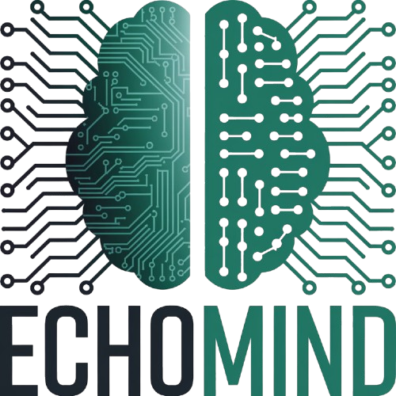

<div
style="
display: flex;
gap: 20px;
"
>
<h1
style="color: green"
> 
Echo Mind
</h1>


</div>

<div style="display: flex; gap: 10px; margin-top: 50px; margin-bottom: 50px;">
  
  
  
</div>

EchoMind is an interactive artificial intelligence system that allows users to converse with virtual personalities based on real or fictional figures, with unique language styles, behavior, and humor. It uses Ollama to run language models locally and React with TypeScript for the frontend.

## Technologies Used

- **Ollama:** A tool for running advanced language models (LLMs).
- **React with TypeScript:** A JavaScript library for building user interfaces, with static typing for greater robustness and security.

## Prerequisites

To run this project, you will need the following installed on your machine:

- Node.js (version 18 or higher recommended)
- npm (Node.js package manager)
- Ollama (installed and configured)

## Getting Started

Follow the instructions below to set up and run the EchoMind project on your local machine.

### 1. Clone the Repository

```bash
git clone https://github.com/igorcalves/EchoMind
cd echomind
```

### 2. Install Dependencies

```bash
npm install
```

### 3. Start Ollama and Download Llama 3

For EchoMind to work, Ollama needs to be running, and the Llama 3 model must be available.

a. Download and Start Ollama
If you don't have Ollama installed yet, follow the instructions on the official website: https://ollama.com/download

After installation, ensure Ollama is running. On many systems, it starts automatically as a background service.

b. Download the Llama 3 Model
Open your terminal and run the command below to download the Llama 3 model. This process may take some time depending on your internet connection.

```bash
ollama run llama3
```

If the Llama 3 model is already downloaded, this command will start a chat session with it. You can simply close this session after the model loads or keep it open in the background. The important thing is that Ollama has the model available for the application to access.

### 4. Run the EchoMind Project

With Ollama configured and the Llama 3 model downloaded, you can start the React application.

In the project's root directory, run the following command:

```bash
npm run dev
```

This command will start the React development server. Typically, the application will be available at http://localhost:5173

### 5. Interacting with EchoMind

Once the application loads in your browser:

You can choose or indicate the personality you want the virtual assistant to adopt.
Type your message or question in the chat interface.
The AI's responses will be displayed progressively, in real-time, using data streaming.

## Important Considerations

For better performance, it is recommended to run Ollama on systems with dedicated GPUs (NVIDIA or AMD), although it may work on integrated GPUs.
Ollama maintains session history and can use previous context to generate more coherent responses. The EchoMind application will resend the conversation history to Ollama with each new question to ensure continuity of interaction.

Windows support for Ollama is currently in preview.
